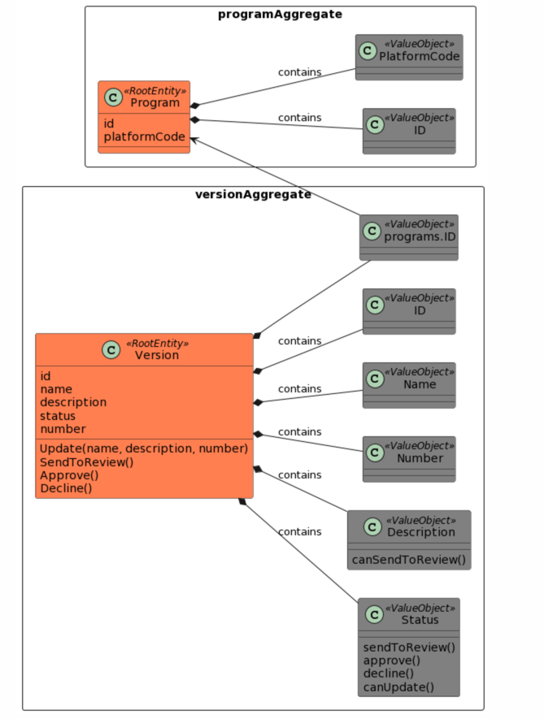
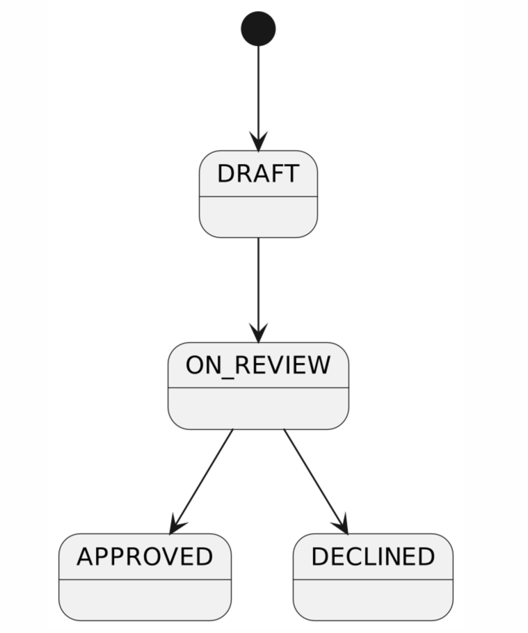

## Use cases
- UC1: Create a new program
- UC2: Update a program version
- UC3: Send to review a program version
- UC4: Approve a program version
- UC5: Decline a program version
- UC6: Get programs from store (it means get all program versions that are approved)

## Domain model
[domain.puml](assets/domain.puml)

## Program version state machine
[program_version_state_machine.puml](assets/program_version_state_machine.puml)

## Logging
[LOGGING.MD](LOGGING.MD)

### Example of testing that application log information with fields from context [handler_test.go](..%2Finternal%2Fapplication%2Fcommands%2Fapproveprogramversion%2Fhandler_test.go)

💡I did it for one command for example. It can be done for all commands and queries, but not all projects need 100% coverage. It depends on the project.

💡If the project require test logging too, it can be done by providing logger in http and application layers. Using slog.Default doesn't allow to test logging. 
